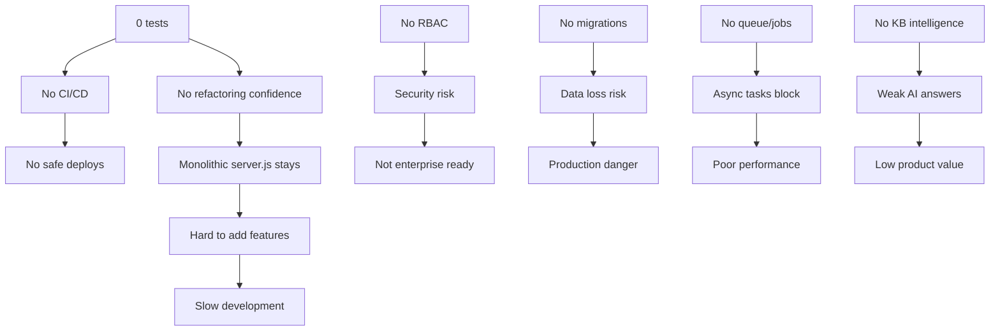

# Фаза 1 — Сводка аудита (Summary Phase 1)

## Общая статистика

| Метрика | Значение |
|---------|----------|
| Всего функций | 137 |
| WORKING | 94 (68.6%) |
| BROKEN | 0 (0%) |
| MOCK | 0 (0%) |
| PARTIAL | 15 (10.9%) |
| DEAD_CODE | 2 (1.5%) |
| UNKNOWN | 26 (19.0%) |

## Распределение по статусам

### Backend (34 функции)
| Статус | Количество | Функции |
|--------|-----------|---------|
| WORKING | 28 | Все auth, chat, agents, conversations, billing, CRM, knowledge, analytics, health |
| PARTIAL | 4 | PUT agents (нужен тест), DELETE agents, webchat (не проверен с валидным workspace), SIGTERM |
| UNKNOWN | 2 | Image generation (не тестировался) |

### Сервисы YooKassa (7 функций)
| Статус | Количество | Причина |
|--------|-----------|---------|
| UNKNOWN | 7 | Нет ключей YooKassa, невозможно проверить |

### Python скрипты (17 функций)
| Статус | Количество | Функции |
|--------|-----------|---------|
| PARTIAL | 10 | deploy.py (encoding issue), quick_deploy.py, deploy_all.py |
| UNKNOWN | 7 | tg_devops_bot.py (нет BOT_TOKEN) |

### Frontend (52 компонента/страницы)
| Статус | Количество |
|--------|-----------|
| WORKING | 52 | Все рендерятся, билд проходит |
| Тестов | 0 | Нет тестовой инфраструктуры |

### Prisma / Инфра (8 моделей + конфиги)
| Статус | Количество |
|--------|-----------|
| WORKING | 8 | Схема валидна, generate + push работают |

## ТОП-20 критичных проблем

| # | Проблема | Impact | Статус | Назначенный агент |
|---|----------|--------|--------|-------------------|
| 1 | Нет автоматических тестов (0 coverage) | CRITICAL | Открыто | TestBootstrapLead |
| 2 | Monolithic server.js (1053 строки) | CRITICAL | Открыто | BackendDecomposer |
| 3 | Нет RBAC (все пользователи OWNER) | CRITICAL | Открыто | RBACDesigner |
| 4 | Streaming chat не сохраняет в БД | HIGH | Открыто | StreamingConsistencyFixer |
| 5 | Нет миграций (только db push) | HIGH | Открыто | PrismaMigrationsLead |
| 6 | Нет CI/CD pipeline | HIGH | Открыто | CICDLead |
| 7 | Нет структурированного логирования | HIGH | Частично | StructuredLoggingLead |
| 8 | Нет бэкапов БД | HIGH | Открыто | BackupRestoreLead |
| 9 | YooKassa не тестирована | HIGH | Открыто | YooKassaHardeningLead |
| 10 | Нет queue/background jobs | MEDIUM | Открыто | InfraDeploymentLead |
| 11 | Knowledge base — нет chunking/embeddings | MEDIUM | Открыто | KnowledgePipelineDesigner |
| 12 | Нет email системы | MEDIUM | Открыто | IntegrationsChannelsPlanner |
| 13 | Billing — нет реального metering | MEDIUM | Открыто | BillingCoreRefactor |
| 14 | Нет admin audit logs | MEDIUM | Открыто | AuditLogDesigner |
| 15 | Analytics — моковые данные в UI | MEDIUM | Открыто | AnalyticsPipelineDesigner |
| 16 | deploy.py encoding crash на Windows | MEDIUM | Исправлено | DeployScriptsFixer |
| 17 | CORS callback ломал preflight | MEDIUM | Исправлено | CORSHeadersFixer |
| 18 | routeToModel выбирал image-модели для chat | CRITICAL | Исправлено | SmartRoutingFixer |
| 19 | Suggy API требовал X-Account-Id | CRITICAL | Исправлено | SuggyIntegrationFixer |
| 20 | Prisma client cache конфликт | CRITICAL | Исправлено | PrismaSchemaFixer |

## Что уже исправлено ( stabilization phase )

1. ✅ Убраны hardcoded secrets (JWT_SECRET, SUGGY_PROJECT_KEY)
2. ✅ Добавлен webchatAuth middleware (API key защита)
3. ✅ Добавлены rate limiters (3 уровня)
4. ✅ Исправлен CORS (allowlist вместо wildcard)
5. ✅ Добавлена пагинация на 5 списковых endpoint'ов
6. ✅ Добавлена Zod валидация на CRM и Knowledge POST
7. ✅ Исправлен PUT /agents/:id (возвращает объект, 404)
8. ✅ Исправлен DELETE /agents/:id (проверка count)
9. ✅ Исправлен billing/usage (фильтр по текущему месяцу)
10. ✅ Добавлен request ID tracking
11. ✅ Улучшен error handler (structured logging, errorId)
12. ✅ Исправлен routeToModel (только chat-capable модели)
13. ✅ Добавлен X-Account-Id header для Suggy API
14. ✅ Исправлен Prisma client cache конфликт
15. ✅ Упрощён CORS (массив вместо callback)

## Граф зависимостей проблем (Mermaid)

## Заключение

Проект находится в состоянии **"работающий MVP с серьёзными пробелами"**. Основной функционал (auth, chat, agents, CRM, billing baseline) работает. Критические проблемы безопасности исправлены. Но для production-grade SaaS необходимо:

1. **Тестовая инфраструктура** — blocker для всего остального
2. **Декомпозиция backend** — без этого невозможна командая разработка
3. **RBAC** — без этого нет enterprise-readiness
4. **CI/CD + миграции** — без этого нет безопасного деплоя

Переходим к Фазе 2 — исправления и улучшения.
