# AgentCore v4 — Target Architecture Document

> **Version**: 1.0  
> **Date**: 2026-05-31  
> **Author**: AgentCore Architecture Team  
> **Status**: Draft / Roadmap

---

## 1. Executive Summary

This document defines the **12–18 month target architecture** for transforming **AgentCore v3** (a working monolith) into a **production-grade SaaS platform** competing in the conversational-AI/ chatbot space with:

- **Chatbase** (AI chatbot builder + analytics)
- **ManyChat** (multi-channel chatbot marketing)
- **Tidio** (live chat + AI + helpdesk)
- **Intercom Fin** (enterprise AI customer-service platform)

The target architecture is **service-oriented**, designed for **multi-tenancy**, **horizontal scalability**, **enterprise security**, and **long-term extensibility** via a marketplace / partner API.

---

## 2. Architectural Principles

| # | Principle | Rationale |
|---|-----------|-----------|
| 1 | **API-First** | Every feature must be consumable via API before UI. Enables partner/white-label integrations. |
| 2 | **Multi-Tenant by Default** | Row-level security + schema isolation where needed. Minimizes infra cost per customer. |
| 3 | **Event-Driven Async Where Possible** | Decouples heavy work (AI inference, analytics, billing) from synchronous request path. |
| 4 | **Cost-Aware AI Gateway** | Model fallback chains, caching, prompt compression, token budgets per tenant. |
| 5 | **Zero-Trust Security** | Every service call authenticated; least privilege RBAC; secrets in Vault. |
| 6 | **Observable Everything** | Metrics, logs, traces, and alerts per service; SLOs defined for all public APIs. |
| 7 | **Immutable Infrastructure** | Docker + Kubernetes + IaC (Terraform). No manual server changes. |

---

## 3. High-Level System Diagram

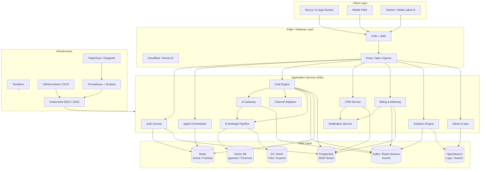

---

## 4. Layer-by-Layer Deep Dive

### 4.1 Edge / API Gateway Layer

| Component | Technology | Responsibilities |
|-----------|------------|------------------|
| **Ingress Controller** | Kong (recommended) or Nginx + Lua | Rate limiting, WAF rules, SSL termination, request/response transformation |
| **Load Balancing** | Cloud ALB / AWS NLB / GCP GLB | TLS passthrough for WebSocket, health-check based routing |
| **API Versioning** | URL path (`/v1/…`, `/v2/…`) + header negotiation | Backward compatibility for 2 major versions |
| **WebSocket / SSE** | Kong TCP mode or dedicated WS ingress | Real-time chat streaming, agent typing indicators, live dashboards |
| **Rate Limiting** | Redis-backed counters (Kong plugin or custom) | Per-tenant, per-API-key, per-IP tiers (Free / Pro / Enterprise) |
| **DDoS / Bot Protection** | Cloudflare or AWS Shield + WAF | Automatic challenge, geo-blocking, threat intelligence feeds |

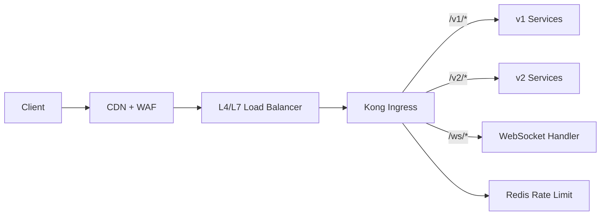

---

### 4.2 Application Services

All services run as **containerized workloads** in Kubernetes (Helm charts per service). Each service exposes:
- **gRPC** for internal East-West communication (fast, typed, contract-first)
- **REST/HTTP** for external North-South via Gateway
- **Async events** via Kafka / Redis Streams for fire-and-forget work

#### 4.2.1 Auth Service

**Purpose**: Identity, access management, tenant isolation entry-point.

| Feature | Implementation Notes |
|---------|---------------------|
| **OAuth2 / OIDC** | Authorization-code + PKCE for SPAs; client-credentials for M2M |
| **SAML 2.0** | `python-saml` or Keycloak bridge for Enterprise SSO |
| **Social Login** | Google, Microsoft, Apple Sign-In |
| **JWT Access + Refresh** | Short-lived access tokens (15 min), rotating refresh tokens (7–30 days) |
| **MFA** | TOTP (Google Authenticator) + WebAuthn / FIDO2 (future) |
| **Password Reset** | Secure token via email, rate-limited, single-use |
| **Tenant Resolution** | Every token embeds `workspace_id`; enforced at Gateway + DB RLS |

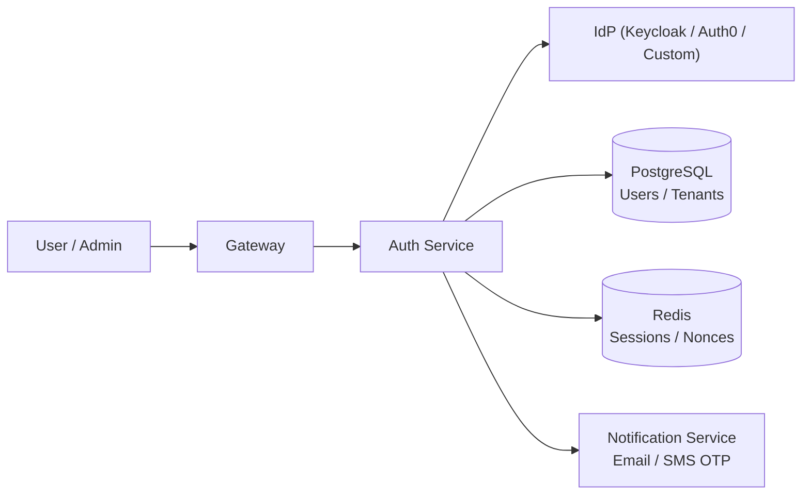

#### 4.2.2 Agent Orchestrator

**Purpose**: Manage AI agent lifecycle, versioning, and deployment strategies.

| Feature | Implementation Notes |
|---------|---------------------|
| **Agent CRUD** | JSON/YAML agent definitions stored in PostgreSQL with version history |
| **Version Control** | Immutable versions; promotion flow (dev → staging → prod per workspace) |
| **A/B Testing** | Traffic split percentages per agent version; metric collection per variant |
| **Environment Isolation** | Dev/staging/prod contexts within a workspace |
| **Rollback** | One-click revert to previous stable version |
| **Template Gallery** | Pre-built agents (customer support, lead gen, FAQ) |

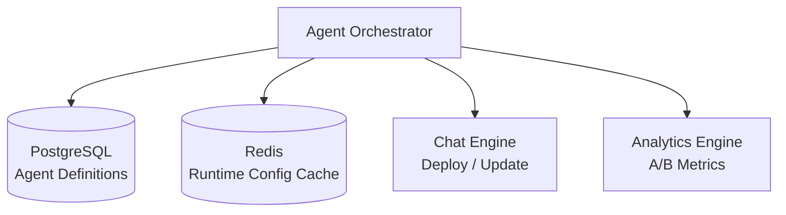

#### 4.2.3 Chat Engine

**Purpose**: The core real-time messaging hub.

| Feature | Implementation Notes |
|---------|---------------------|
| **Message Routing** | Tenant-scoped routing tables; channel affinity |
| **Streaming Responses** | SSE or WebSocket streaming from AI Gateway to end-user |
| **Persistence** | All messages → PostgreSQL (append-only, partitioned by time) |
| **Context Management** | Conversation state in Redis (TTL-based sliding window); long-term context via summarization |
| **Typing Indicators** | WebSocket broadcast per conversation |
| **Human Handoff** | Escalation queue; agent assignment; presence tracking |
| **Conversation Tags & Notes** | Manual tags, auto-tags via AI classification |

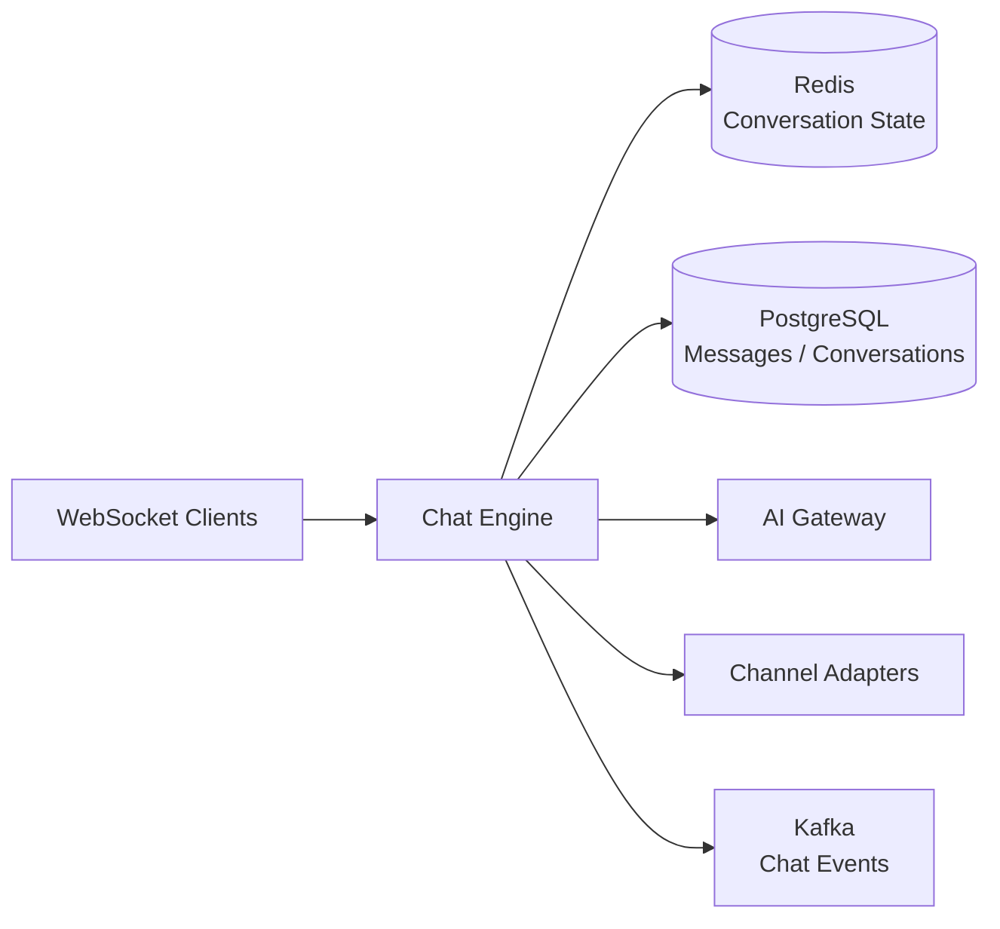

#### 4.2.4 AI Gateway

**Purpose**: Abstract AI model providers; optimize cost, latency, and reliability.

| Feature | Implementation Notes |
|---------|---------------------|
| **Provider Pool** | Suggy (primary), OpenAI (GPT-4o / GPT-4-turbo), Anthropic (Claude 3), Google (Gemini), Custom (self-hosted) |
| **Fallback Chains** | Primary down → fallback model; circuit breaker per provider; automatic retry with backoff |
| **Token Budgets** | Per-tenant monthly/quota limits; real-time usage streaming to Billing |
| **Prompt Caching** | Redis cache for deterministic / near-deterministic prompts (with TTL) |
| **Prompt Versioning** | A/B test prompts; track prompt → response quality correlation |
| **Cost Optimization** | Route cheaper model for low-confidence needs; model distillation pipeline (future) |
| **Streaming** | Proxy SSE chunks from provider through to Chat Engine with minimal buffering |

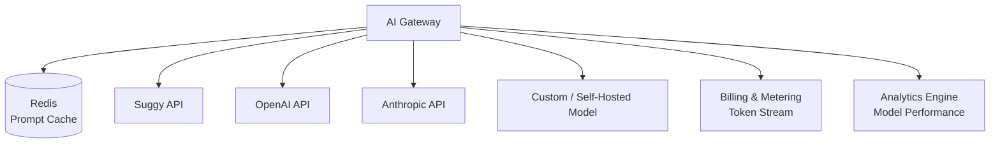

#### 4.2.5 Channel Adapters

**Purpose**: Normalize inbound/outbound messaging across platforms.

| Channel | Protocol / API | Key Features |
|---------|---------------|--------------|
| **Webchat** | WebSocket + REST | Embeddable widget, customizable theme, proactive messages |
| **Telegram** | Bot API | Inline keyboards, file handling, group chat support |
| **WhatsApp** | WhatsApp Business API (Meta) | Template messages, session windows, rich media |
| **Facebook Messenger** | Graph API | Handover protocol, persistent menu, ICE breakers |
| **Slack** | Slack Bolt / Events API | DM + channel support, slash commands, interactive blocks |
| **Email** | IMAP/SMTP or SendGrid inbound | Thread reconstruction, attachment handling |
| **SMS** | Twilio / Vonage | Short-code, two-way, link to webchat |

All adapters publish a canonical internal event schema to Kafka so downstream services (Chat Engine, CRM, Analytics) are channel-agnostic.

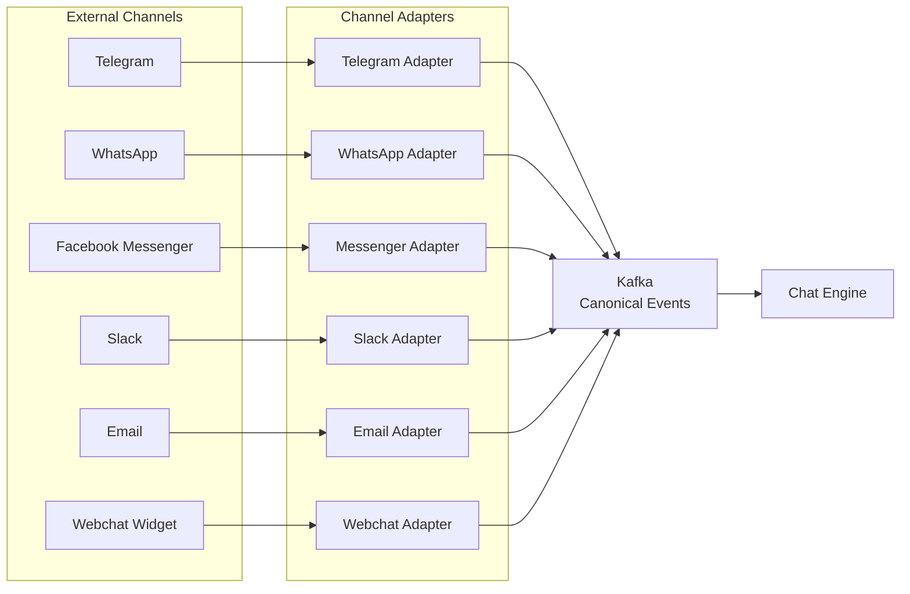

#### 4.2.6 Knowledge Pipeline

**Purpose**: Ingest, chunk, embed, and retrieve documents for RAG (Retrieval-Augmented Generation).

| Stage | Technology | Details |
|-------|------------|---------|
| **Ingestion** | REST API / S3 webhook | PDF, DOCX, TXT, Markdown, HTML, CSV |
| **Extraction** | Apache Tika / unstructured.io / custom | Text + metadata + table extraction |
| **Chunking** | LangChain / LlamaIndex strategies | Semantic chunking, overlap, header-aware splitting |
| **Embedding** | OpenAI `text-embedding-3-small/large`, or local `bge-large-en` | Async batch jobs, deduplication |
| **Vector DB** | **pgvector** (recommended for operational simplicity) or Pinecone / Weaviate | HNSW indexes, tenant-filtered queries |
| **Retrieval** | Hybrid search (vector + BM25/keyword) | Re-ranking (cross-encoder), metadata filters |
| **Sync** | Event-driven | Document updated → re-index automatically |

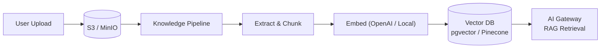

#### 4.2.7 CRM Service

**Purpose**: Lightweight CRM tailored for conversational data.

| Feature | Implementation Notes |
|---------|---------------------|
| **Contacts** | Unified profile across channels (merge by phone/email) |
| **Leads & Pipelines** | Kanban stages, custom fields, automation triggers |
| **Conversations ↔ CRM Link** | Every chat attached to contact; timeline view |
| **Automations** | If-this-then-that rules (e.g., tag lead if AI detects buying intent) |
| **Segments** | Dynamic contact lists based on behavior/tags |
| **Import / Export** | CSV, API, future sync with HubSpot / Salesforce |

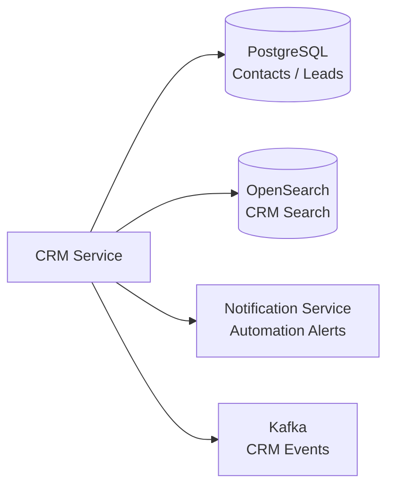

#### 4.2.8 Billing & Metering

**Purpose**: Real-time usage tracking, quota enforcement, invoicing.

| Feature | Implementation Notes |
|---------|---------------------|
| **Metering** | Kafka consumers aggregate events (messages, AI tokens, storage, API calls) |
| **Quotas** | Soft / hard limits per plan; real-time check via Redis counters |
| **Pricing Tiers** | Free, Starter, Pro, Enterprise (seats + usage-based) |
| **Payments** | **Stripe** (global) + **YooKassa** (Russia/CIS) |
| **Invoicing** | PDF generation, email delivery, tax calculation (TaxJar / Stripe Tax) |
| **Usage Dashboard** | Tenant-facing real-time consumption view |
| **Webhooks** | Stripe/YooKassa → internal event translation |

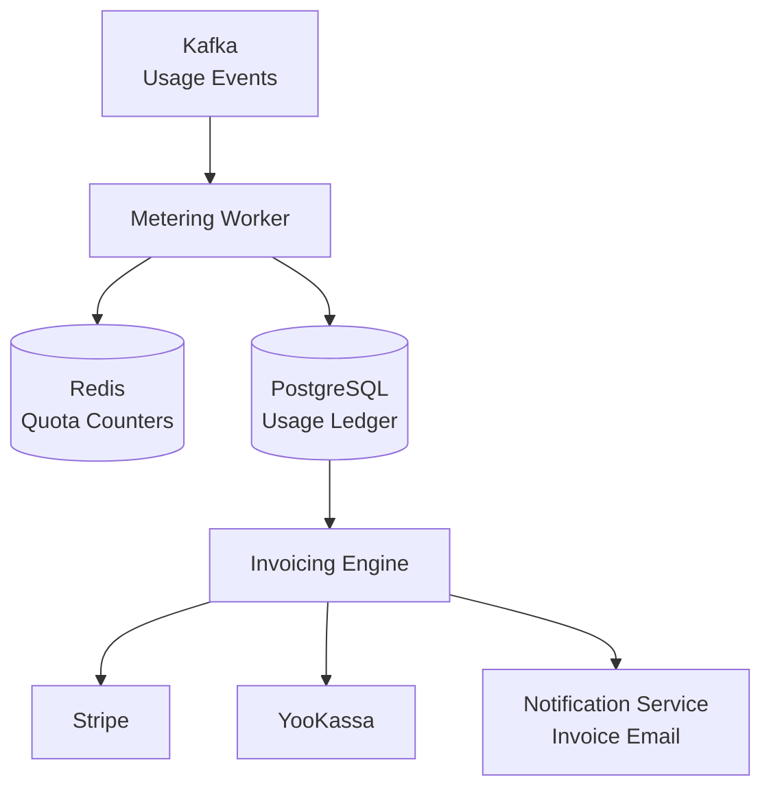

#### 4.2.9 Analytics Engine

**Purpose**: Real-time and batch analytics for tenant dashboards and internal observability.

| Feature | Implementation Notes |
|---------|---------------------|
| **Event Streaming** | Kafka or Redis Streams (choose Kafka if volume > 10k events/sec) |
| **Event Schema** | Avro / Protobuf with Schema Registry |
| **Real-time Aggregates** | Redis / Materialize / Flink for live counters (active chats, AI latency) |
| **Batch Aggregates** | ClickHouse or PostgreSQL materialized views for historical reporting |
| **Dashboards** | Pre-built: Conversations, AI Performance, CSAT, Channel Mix, Revenue Attribution |
| **Export** | CSV, PDF, scheduled email reports |
| **Custom Events** | Tenant-defined event tracking (via JS snippet or API) |

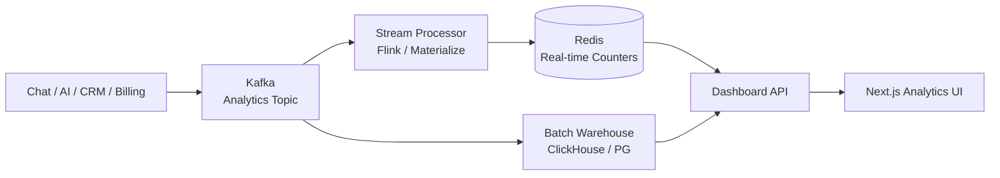

#### 4.2.10 Notification Service

**Purpose**: Centralized, channel-agnostic delivery of transactional and marketing notifications.

| Channel | Provider | Use Cases |
|---------|----------|-----------|
| **Email** | SendGrid / Mailgun / AWS SES | Invoice, password reset, digest, alerts |
| **SMS** | Twilio / Vonage | OTP, urgent alerts, billing reminders |
| **Push** | Firebase Cloud Messaging / OneSignal | Mobile PWA push, proactive chat |
| **In-App** | WebSocket/SSE | Real-time toast, banner, chat handoff |

| Feature | Implementation Notes |
|---------|---------------------|
| **Templating** | Handlebars / MJML for email; rich message templates for other channels |
| **Localization** | i18n templates per tenant locale |
| **Rate Limiting** | Per-user, per-channel caps |
| **Delivery Tracking** | Bounce, open, click, failure metrics → Analytics |
| **Preference Center** | User opt-in/opt-out per channel and category |

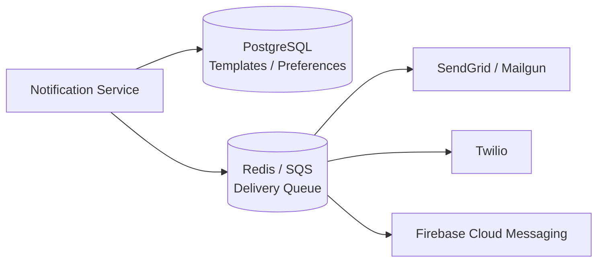

#### 4.2.11 Admin & Ops Service

**Purpose**: Internal operations, audit, feature flags, and tenant management.

| Feature | Implementation Notes |
|---------|---------------------|
| **Audit Logs** | Immutable log of all admin/tenant actions (PG append-only table or ClickHouse) |
| **System Health** | Aggregated service health, dependency checks, synthetic monitoring |
| **Feature Flags** | LaunchDarkly or Unleash; per-tenant / per-workspace targeting |
| **Tenant Admin** | Impersonation (with audit), plan upgrades, support tools |
| **Security Events** | Brute-force detection, anomalous token usage, data export alerts |

---

### 4.3 Data Layer

#### 4.3.1 PostgreSQL (Primary OLTP)

- **Engine**: PostgreSQL 16+
- **Tenancy**: Row-Level Security (RLS) policies per `workspace_id`
- **Partitioning**: Time-based partitioning for `messages`, `events`, `audit_logs`
- **Replicas**: Read replicas for analytics queries; connection pooling via PgBouncer
- **Migrations**: migrations managed by Flyway or Alembic; CI gate for backwards-compatible changes
- **Backups**: WAL-E / Barman → S3; point-in-time recovery target RPO < 5 min

#### 4.3.2 Redis

- **Caching**: Agent configs, user sessions, API rate-limit counters (TTL-based)
- **Pub/Sub**: Real-time presence, typing indicators, broadcast notifications
- **Streams**: Lightweight event buffering if Kafka not yet deployed
- **Persistence**: AOF + RDB for session durability; cluster mode for HA

#### 4.3.3 Vector DB

- **Option A — pgvector** (recommended for MVP→Scale): Same operational stack as PostgreSQL; `pgvector` extension; HNSW indexing. Good for < 10M vectors per tenant.
- **Option B — Pinecone / Weaviate**: If vector scale exceeds pgvector performance or multi-modal search needed.

#### 4.3.4 Object Storage (S3 / MinIO)

- File uploads (avatars, documents, exports)
- Backup snapshots
- Static asset hosting (CDN-fronted)
- Lifecycle policies: transition to glacier after 90 days

#### 4.3.5 Search / Logs (OpenSearch)

- Full-text CRM contact search
- Log aggregation from all services (Fluent Bit → OpenSearch)
- Dashboards in Grafana or OpenSearch Dashboards

---

### 4.4 Infrastructure

#### 4.4.1 Compute Orchestration

- **Container Runtime**: Docker
- **Orchestrator**: Kubernetes (managed: EKS, GKE, or AKS)
- **Service Mesh**: Linkerd or Istio (optional; add if > 15 services or strict mTLS required)
- **Scaling**: HPA (CPU/memory) + KEDA (event-driven: Kafka lag, queue depth)
- **GitOps**: ArgoCD or Flux for declarative cluster state

#### 4.4.2 CI/CD

| Stage | Tool | Notes |
|-------|------|-------|
| **Source** | GitHub | Monorepo or multi-repo per service |
| **Build** | GitHub Actions | Buildx multi-arch images, cache layers |
| **Test** | GitHub Actions | Unit, integration, contract (Pact), e2e (Playwright) |
| **Security Scan** | Trivy, Snyk | Image vuln scan, dependency check, secret detection |
| **Deploy** | GitHub Actions → ArgoCD | Canary or blue-green via Flagger |
| **DB Migrations** | Job runner in K8s | Run before app rollout; backwards-compatible required |

#### 4.4.3 Infrastructure as Code

- **Terraform** for all cloud resources (VPC, DB, K8s, IAM, S3, DNS)
- **Helm** charts per service; shared library chart for common patterns
- **Environment parity**: Dev → Staging → Prod; staging mirrors prod topology at smaller scale

#### 4.4.4 Monitoring & Alerting

| Layer | Tool | Metrics |
|-------|------|---------|
| **Metrics** | Prometheus + Grafana | Request rate, error rate, latency (RED), AI token cost, queue depth |
| **Logs** | Fluent Bit → OpenSearch / Loki | Structured JSON logs per service; correlation ID propagation |
| **Traces** | OpenTelemetry + Jaeger/Tempo | End-to-end trace: Gateway → Chat → AI Gateway → Provider |
| **Uptime** | Synthetic monitoring (Grafana or Pingdom) | Core API health, chat widget load, signup flow |
| **Alerting** | PagerDuty / Opsgenie | P1 (page on-call), P2 (Slack alert), P3 (ticket) |

#### 4.4.5 Backup & Disaster Recovery

| Component | Strategy | RTO | RPO |
|-----------|----------|-----|-----|
| PostgreSQL | WAL-E streaming to S3 + cross-region replica | 30 min | 5 min |
| Redis | AOF + RDB snapshot to S3 hourly | 15 min | 1 hour |
| S3 / MinIO | Versioning + cross-region replication | 15 min | real-time |
| Kubernetes | Cluster state in Git (ArgoCD); redeploy | 1 hour | N/A (stateless) |

---

### 4.5 Frontend Architecture

#### 4.5.1 Next.js 14 (App Router)

- **Rendering**: Server Components by default; Client Components for interactivity
- **Data Fetching**: React Server Components + tRPC or REST; caching via Next.js `fetch` + Redis
- **Styling**: Tailwind CSS + Radix UI / shadcn/ui for rapid, consistent UI
- **State**: Zustand for client state; React Query for server state
- **i18n**: `next-intl` for multi-language support

#### 4.5.2 Real-Time Updates

- **WebSocket** or **SSE** for chat streaming and live dashboards
- **Fallback**: Long-polling for restrictive networks

#### 4.5.3 Webchat Widget

- **Standalone embed**: Vanilla JS snippet (no framework dependency) injected into customer sites
- **Config**: Color, avatar, greeting, position via portal UI
- **Security**: CSP-compliant, iframe sandbox option, origin whitelist

#### 4.5.4 Admin Dashboard

- **Same Next.js build**, gated by RBAC roles (`admin`, `owner`, `agent`, `viewer`)
- **Route guards**: Middleware checking role + permissions
- **Future**: Micro-frontends if admin surface becomes too large (e.g., separate CRM build)

#### 4.5.5 Mobile PWA

- **next-pwa** or custom service worker
- **Offline**: Read-only cache of recent conversations
- **Push**: Firebase Cloud Messaging integration

---

### 4.6 Security Model

#### 4.6.1 Identity & Access

- **RBAC Hierarchy**: `Workspace` → `WorkspaceMember` → `Role` → `Permission`
- **Permissions**: Granular (e.g., `agent:read`, `agent:write`, `billing:read`, `workspace:admin`)
- **API Keys**: Scoped to workspace + environment; rotate via UI; last-used tracking

#### 4.6.2 Communication Security

- **TLS 1.3** everywhere (external + internal if service mesh used)
- **mTLS** between services (Istio/Linkerd or Kong mesh)
- **Webhook Signature Verification**: HMAC-SHA256 for all inbound webhooks (Stripe, channels, etc.)
- **CSP / HSTS / Secure Cookies**: OWASP headers enforced at Gateway

#### 4.6.3 Data Protection

- **At Rest**: AES-256 (cloud provider managed keys or AWS KMS / GCP CMEK)
- **In Transit**: TLS 1.3
- **Secrets**: HashiCorp Vault or cloud-native secret manager; no secrets in env vars at runtime (use sidecar injection)
- **PII Handling**: Automatic detection in logs; masking in non-prod environments

#### 4.6.4 Compliance

| Standard | Readiness Steps |
|----------|-----------------|
| **GDPR** | Data export (machine-readable), deletion APIs, anonymization pipelines, consent tracking, DPO contact |
| **SOC 2 Type II** | Access logs, change management, vendor risk assessments, annual pen-test, incident response plan |
| **ISO 27001** (future) | ISMS documentation, risk register, regular audits |

---

## 5. Migration Path: Current → Target

### Phase 1 — MVP (Current State, Partially Done)

**Goal**: Ship a working monolith that validates product-market fit.

- ✅ Monolithic API (Python / Node / Go — based on current stack)
- ✅ Next.js frontend (basic chat + admin)
- ✅ PostgreSQL database (single schema, basic multi-tenancy)
- ✅ Suggy + OpenAI integration (hardcoded or simple switch)
- ✅ Webchat widget (embeddable)
- 🔄 In Progress: Basic RBAC, channel adapters (Telegram, WhatsApp)

**Exit Criteria**: First paying customers; < 1s API p95 latency; 99.5% uptime.

---

### Phase 2 — Stabilization (Months 0–2)

**Goal**: Harden the foundation before scaling.

| Workstream | Deliverables |
|------------|--------------|
| **Testing** | 80%+ unit test coverage; integration tests for Chat → AI flow; Playwright e2e for critical paths |
| **RBAC** | Full role/permission system; admin invite flow; API key management |
| **Database** | Migration framework (Flyway/Alembic); partitioned tables for messages; read replica for analytics |
| **CI/CD** | GitHub Actions: build → test → scan → deploy to staging; automated production deploys with approval gate |
| **Monitoring** | Prometheus + Grafana for infra; Sentry for application errors; PagerDuty integration |
| **Security** | Penetration test; dependency vuln scanning; secret scanning in CI; CSP headers |

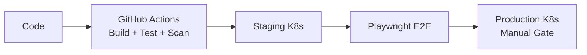

---

### Phase 3 — Scale (Months 2–6)

**Goal**: Extract high-load services; introduce caching and queues.

| Workstream | Deliverables |
|------------|--------------|
| **Service Extraction** | Chat Engine (stateful WebSocket pods); AI Gateway (stateless, auto-scaling); Billing (async workers) |
| **Caching** | Redis for sessions, agent configs, rate limits |
| **Queue / Events** | Redis Streams (quick win) or Kafka (if volume warrants); async: AI calls, notifications, analytics |
| **Channel Expansion** | Facebook Messenger, Slack, Email adapters |
| **Knowledge Pipeline** | Document upload → chunk → embed → pgvector; RAG retrieval wired to AI Gateway |
| **Vector DB** | Deploy pgvector extension; hybrid search experiments |
| **CDN + Gateway** | Kong ingress with rate limiting, API versioning (`/v1`, `/v2`) |

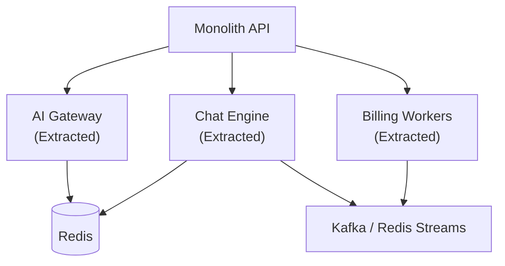

---

### Phase 4 — Enterprise (Months 6–12)

**Goal**: Win mid-market and enterprise deals; prove reliability.

| Workstream | Deliverables |
|------------|--------------|
| **SSO / SAML** | Auth Service supports SAML 2.0, OIDC, SCIM provisioning |
| **Advanced Analytics** | ClickHouse or materialized views; custom dashboards; scheduled reports |
| **Custom Models** | Bring-your-own-key (BYOK); self-hosted model endpoint support in AI Gateway |
| **SLA Guarantees** | 99.9% uptime SLA; public status page; incident response runbooks |
| **Compliance** | GDPR full implementation; SOC 2 Type II audit kickoff |
| **CRM Service** | Contact/lead/pipeline feature set; basic automation rules |
| **White-Label** | Custom domain, branding, outgoing email sender |

---

### Phase 5 — Platform (Months 12–18)

**Goal**: Become an extensible platform, not just a product.

| Workstream | Deliverables |
|------------|--------------|
| **Marketplace** | App directory: third-party channel adapters, CRM syncs, analytics connectors |
| **Developer API** | Public REST + GraphQL API; webhooks; SDKs (JS, Python) |
| **Partner Integrations** | HubSpot, Salesforce, Zendesk, Make/Zapier native connectors |
| **White-Label Platform** | Reseller tier: sub-accounts, custom pricing, own branding |
| **Advanced AI** | Fine-tuning pipeline per tenant; agent collaboration (multi-agent swarms); voice channel (future) |

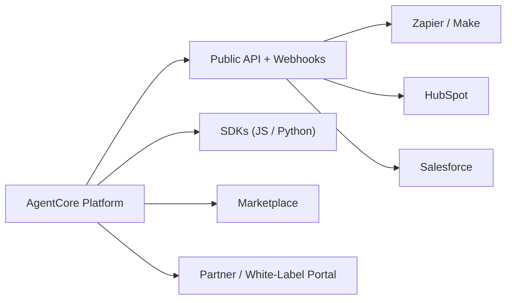

---

## 6. Cross-Cutting Concerns

### 6.1 Multi-Tenancy Strategy

- **Primary**: **Shared database, shared schema** with PostgreSQL RLS
- **Isolation**: Every query filtered by `workspace_id`; application layer enforces injection
- **Future**: **Schema-per-tenant** or **database-per-tenant** for enterprise isolation (Phase 4+)
- **Tenant Metadata**: Cached in Redis; resolved from JWT or API key at Gateway

### 6.2 Cost Management

| Area | Tactic |
|------|--------|
| **AI Tokens** | Cache common prompts; route cheaper models for low-stakes queries; token budgets per tenant |
| **Compute** | KEDA auto-scaling to zero for low-traffic services; spot instances for batch jobs |
| **Storage** | S3 lifecycle to glacier; compress old message partitions; purge soft-deleted data after 30 days |
| **Bandwidth** | CDN caching for static assets; gzip/Brotli at Gateway |

### 6.3 Incident Response

1. **Detection**: PagerDuty alert (SLO breach, error rate spike, AI provider outage)
2. **Triage**: Runbook in Notion/GitHub; automated diagnostic job collects logs/traces
3. **Mitigation**: Circuit breaker to fallback AI provider; scale pods horizontally; disable non-critical features
4. **Communication**: Status page update; customer email if > 15 min degradation
5. **Post-Mortem**: Blameless review within 48 hours; action items in Jira/GitHub Projects

---

## 7. Key Decisions & Trade-offs

| Decision | Choice | Rationale | Trade-off |
|----------|--------|-----------|-----------|
| **Vector DB** | pgvector (initial) | Same ops stack as PostgreSQL; sufficient for < 10M vectors | May need Pinecone/Weaviate at massive scale |
| **Queue** | Redis Streams → Kafka | Redis Streams for quick async win; Kafka when volume justifies ops cost | Kafka adds operational complexity |
| **SSO** | Keycloak vs. custom | Keycloak gives SAML/OAuth2/SCIM out of box; custom for tighter UX control | Keycloak is heavier; custom takes longer |
| **Frontend** | Next.js 14 monolith vs. micro-frontends | Monolith for speed now; micro-frontends only if team size > 15 frontend devs | Monolith can become deployment bottleneck |
| **AI Gateway** | In-house vs. off-the-shelf (e.g., LiteLLM) | In-house for cost optimization logic, Suggy-specific features, fallback chains | Off-the-shelf faster to deploy but less control |
| **K8s vs. Swarm** | Kubernetes | Industry standard, rich ecosystem, managed offerings | Higher learning curve than Docker Swarm |

---

## 8. Appendix

### A. Glossary

| Term | Definition |
|------|------------|
| **RAG** | Retrieval-Augmented Generation: augmenting LLM prompts with retrieved document snippets |
| **RLS** | Row-Level Security: PostgreSQL feature to restrict rows per tenant |
| **SLO** | Service Level Objective: target reliability/latency metric |
| **SaaS** | Software as a Service: multi-tenant cloud-hosted software |
| **BYOK** | Bring Your Own Key: tenant supplies their own AI provider API key |

### B. Reference Links

- [Kong Gateway Docs](https://docs.konghq.com/)
- [Kubernetes HPA & KEDA](https://keda.sh/)
- [pgvector](https://github.com/pgvector/pgvector)
- [OpenTelemetry](https://opentelemetry.io/)
- [Terraform Best Practices](https://www.terraform-best-practices.com/)

---

> **Next Steps**: Review this document with engineering leads; prioritize Phase 2 tickets; begin Helm chart scaffolding for Chat Engine and AI Gateway extraction.
